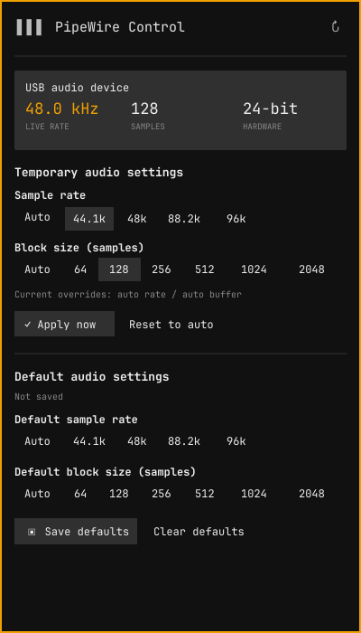

# PipeWire Control

PipeWire Control is built for professional audio engineers using  DAWs such as [REAPER](https://www.reaper.fm/) and other Linux-native digital audio workstations. It provides quick access to PipeWire's sample-rate and block-size controls from the Omarchy bar, alongside live hardware and graph status.

## Interface



## Install

Requires Omarchy's Quickshell plugin host, Python 3, `pw-metadata`, and `pw-top`.

```bash
omarchy plugin add https://github.com/adamtcroft/omarchy-pipewire-control --enable
```

Click the equalizer icon in the bar to open the panel.

## Controls

- **Temporary audio settings** choose a sample rate and block size for the current session.
- **Apply now** sets those temporary overrides. Stop recording before confirming; changes affect all system audio.
- **Reset to auto** clears temporary overrides.
- **Default audio settings** have their own sample-rate and block-size selectors.
- **Save defaults** writes the selected defaults without restarting audio. **Clear defaults** removes this plugin's saved defaults; neither action changes current audio.

Selecting a value does not apply or save it until you confirm the corresponding action. **Auto** defers to PipeWire's other settings. Saving Auto for both values removes the plugin's defaults file. Applications can request a different buffer size when no temporary override is active.

The status card shows a USB device's active rate and advertised valid bit depth, plus running graph driver buffer sizes. Bit depth is read-only. With multiple USB devices, the first active device is shown; graph buffer sizes may belong to other devices. Non-USB hardware details are not available in the card. For the full device and graph report, run `python3 control.py status` from the plugin directory.

Refresh status with the refresh button or middle-click the bar icon. The open panel refreshes every five seconds. Escape cancels a confirmation or closes the panel; Tab and Enter/Space navigate controls.

## Remove

Use **Clear defaults** and **Reset to auto** first if you want to undo audio settings. Removing the widget alone preserves them.

```bash
omarchy plugin remove io.github.adamtcroft.pipewire-control
```

## Files and permissions

The plugin reads PipeWire metadata, `pw-top` output and USB information from `/proc/asound`. Applying changes calls `pw-metadata` for the current user's audio session. Failed partial applies attempt to restore the previous overrides.

Saved defaults are stored in:

```text
~/.config/pipewire/pipewire.conf.d/90-pipewire-control.conf
```

`XDG_CONFIG_HOME` is respected. The plugin refuses to overwrite a file or symlink it does not own. It does not restart audio, use sudo, access the network, or edit packaged Omarchy files.

## Development

```bash
git clone https://github.com/adamtcroft/omarchy-pipewire-control
cd omarchy-pipewire-control
python3 -m unittest -v
omarchy plugin validate .
bash install.sh
```

The development installer symlinks the checkout into the user plugin directory, backs up `shell.json`, and enables the widget. Keep the checkout in place while installed. Use `bash uninstall.sh` to remove that symlink; the source and audio settings are preserved.

If the shell retains old QML after an update, run `omarchy restart shell`. This restarts the desktop shell, not PipeWire.

Tests use mocks and temporary files and do not change system audio. The UI uses Omarchy's native theme and popup components; no separate dialog toolkit is needed.

## License

[MIT](LICENSE)
